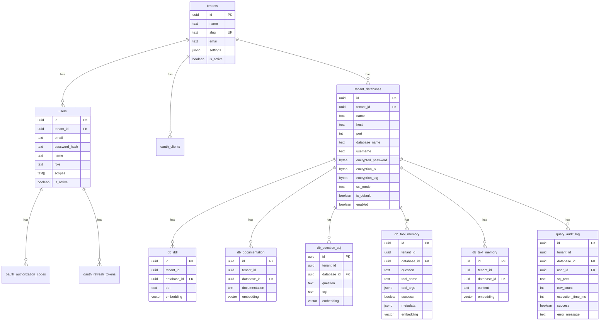

# Rewrite Pundit from Python/AWS to TypeScript/Vercel/Neon

## Enhancement Summary

**Deepened on:** 2026-02-20
**Review agents used:** security-sentinel, architecture-strategist, performance-oracle, kieran-typescript-reviewer, data-integrity-guardian

### Key Improvements

1. **SQL injection defense-in-depth**: Read-only DB role + `SET TRANSACTION READ ONLY` on tenant connections, not just SQL parsing
2. **HNSW indexes instead of IVFFlat**: IVFFlat fails on small/empty tables; HNSW works from day one with no maintenance
3. **Consolidated RAG query**: Merge 7 sequential similarity searches into 1 CTE query (60-500ms savings per search)
4. **Type-safe DB layer**: `queryOne<T>`/`queryMany<T>` with Zod validation on all DB returns
5. **AsyncLocalStorage for request context**: Replace module-level state (broken in serverless) with Node.js AsyncLocalStorage
6. **Encryption key derivation**: HKDF from ENCRYPTION_KEY instead of raw key usage; add `encryption_key_version` for rotation
7. **generateObject with Zod**: Eliminates JSON parsing from Claude responses — structured output via Vercel AI SDK

### New Considerations Discovered

- Module-level state sharing between `execute_sql` and `visualize_data` won't work in Vercel serverless — each invocation may be a different isolate
- IVFFlat indexes on empty tables return zero results regardless of data — must use HNSW
- Missing `OPENAI_API_KEY` and `ANTHROPIC_API_KEY` in env var table
- Signup must be transactional (tenant + user creation)
- DDL replacement (pull-ddl idempotent) must be transactional: generate all new embeddings before DELETE + INSERT
- `query_audit_log` needs `created_at` timestamp and `ON DELETE SET NULL` for user_id FK

## Overview

Full rewrite of Pundit — an MCP server for AI-powered database querying — from Python/Lambda/Aurora to TypeScript/Next.js 16/Neon PostgreSQL. The rewrite follows the architecture patterns established in Herald's completed migration, adding Pundit-specific features: RAG with pgvector, tenant database connections, SQL generation via Vercel AI Gateway, and server-side chart rendering.

## Problem Statement

Pundit's Python/AWS stack (Lambda, Aurora Serverless v2, SAM, API Gateway, Secrets Manager, S3, CloudFront, VPC, NAT Gateway) creates operational overhead and cost for what is fundamentally a serverless application. Herald's migration proved that the Vercel + Neon stack eliminates this complexity while maintaining all functionality.

## Proposed Solution

Clean slate rewrite in TypeScript/Next.js 16, deployed on Vercel with Neon PostgreSQL. Reuse Herald's proven patterns for OAuth 2.1, MCP endpoints, database access, and middleware. Port Pundit-specific features (RAG, SQL generation, chart rendering) using TypeScript equivalents.

## Architecture

### Service Map

| AWS Service | Vercel/Neon Replacement |
|---|---|
| Lambda (Python 3.12) | Next.js API Routes |
| Aurora Serverless v2 | Neon PostgreSQL (pgvector) |
| API Gateway (HTTP) | Vercel Edge Network |
| S3 (charts) | Vercel Blob |
| CloudFront | Vercel Edge Network |
| Secrets Manager | Encrypted columns in Neon + env vars |
| SAM/CloudFormation | vercel.json |
| Bedrock (Claude) | Vercel AI Gateway |
| VPC + NAT Gateway | Not needed |

### Target Project Structure

```
pundit/
├── app/
│   ├── (admin)/
│   │   ├── dashboard/page.tsx
│   │   ├── databases/page.tsx
│   │   ├── databases/[id]/page.tsx
│   │   ├── users/page.tsx
│   │   └── layout.tsx
│   ├── api/
│   │   ├── oauth/
│   │   │   ├── authorize/route.ts
│   │   │   ├── token/route.ts
│   │   │   ├── register/route.ts
│   │   │   └── userinfo/route.ts
│   │   ├── admin/
│   │   │   ├── databases/route.ts
│   │   │   ├── databases/[id]/route.ts
│   │   │   ├── databases/[id]/ddl/route.ts
│   │   │   ├── databases/[id]/docs/route.ts
│   │   │   ├── databases/[id]/examples/route.ts
│   │   │   ├── databases/[id]/text-memory/route.ts
│   │   │   ├── databases/[id]/tool-memory/route.ts
│   │   │   ├── databases/[id]/test-connection/route.ts
│   │   │   ├── databases/[id]/ai/pull-ddl/route.ts
│   │   │   ├── databases/[id]/ai/generate-docs/route.ts
│   │   │   ├── databases/[id]/ai/generate-examples/route.ts
│   │   │   ├── databases/[id]/ai/analyze/route.ts
│   │   │   ├── users/route.ts
│   │   │   ├── users/[id]/route.ts
│   │   │   └── stats/route.ts
│   │   ├── mcp/route.ts
│   │   ├── cron/cleanup/route.ts
│   │   ├── signup/route.ts
│   │   └── login/route.ts
│   ├── .well-known/
│   │   ├── oauth-authorization-server/route.ts
│   │   └── oauth-protected-resource/route.ts
│   ├── mcp/route.ts
│   ├── login/page.tsx
│   ├── callback/page.tsx
│   └── page.tsx
├── components/
│   ├── admin-layout.tsx
│   ├── landing/
│   └── ui/
├── lib/
│   ├── oauth.ts
│   ├── oauth-client.ts
│   ├── mcp-tools.ts
│   ├── db.ts
│   ├── tenant-db.ts
│   ├── crypto.ts
│   ├── embeddings.ts
│   ├── rag.ts
│   ├── sql-generator.ts
│   ├── schema-introspector.ts
│   ├── chart.ts
│   ├── blob.ts
│   ├── admin-auth.ts
│   ├── auth-context.tsx
│   ├── api-client.ts
│   ├── env.ts
│   └── utils.ts
├── migrations/
│   └── 001_schema.sql
├── scripts/
│   └── migrate.ts
├── middleware.ts
├── vercel.json
├── package.json
├── tsconfig.json
└── CLAUDE.md
```

### Database Schema (ERD)



## Implementation Phases

### Phase 1: Project Foundation

Scaffold Next.js 16 project, configure Neon, port schema, deploy skeleton to Vercel.

#### 1.1 Scaffold Next.js 16 Project

**New file: `package.json`**
```json
{
  "name": "pundit",
  "version": "0.1.0",
  "private": true,
  "scripts": {
    "dev": "next dev --turbopack",
    "build": "next build --turbopack",
    "start": "next start",
    "lint": "next lint",
    "migrate": "tsx scripts/migrate.ts"
  }
}
```

Dependencies to install:
- `next@^16`, `react@^19`, `react-dom@^19`
- `@neondatabase/serverless` — Neon driver
- `@vercel/blob` — Blob storage
- `mcp-handler` — MCP protocol
- `jose` — JWT (HS256)
- `bcryptjs` — Password hashing (NOT native `bcrypt` — fails on Vercel serverless)
- `zod` — Schema validation
- `ai`, `@ai-sdk/openai`, `@ai-sdk/anthropic` — Vercel AI SDK
- `pg` — PostgreSQL driver for tenant DB connections
- `chartjs-node-canvas`, `chart.js` — Server-side chart rendering
- `tailwindcss@4`, `@tailwindcss/postcss`
- `@radix-ui/*`, `lucide-react`, `class-variance-authority`, `clsx`, `tailwind-merge`
- `next-themes`

Dev dependencies: `typescript@^5.9`, `tsx`, `@types/node`, `@types/react`, `@types/react-dom`, `@types/bcryptjs`, `@types/pg`

#### 1.2 Environment Validation

**New file: `lib/env.ts`**

Zod schema validating at runtime:

| Variable | Required | Description |
|---|---|---|
| `DATABASE_URL` | Yes | Neon connection string |
| `JWT_SECRET` | Yes | JWT signing secret (min 32 chars) |
| `BLOB_READ_WRITE_TOKEN` | Yes | Vercel Blob token |
| `NEXT_PUBLIC_URL` | Yes | Public app URL |
| `ENCRYPTION_KEY` | Yes | AES-256-GCM key for tenant DB credentials (32 bytes hex) |
| `ENVIRONMENT` | No | `dev` or `prod` (default: `dev`) |
| `CRON_SECRET` | No | Vercel cron auth |
| `ALLOWED_DCR_DOMAINS` | No | Comma-separated (default: `claude.ai,localhost,127.0.0.1`) |
| `OPENAI_API_KEY` | Yes | OpenAI API key for embeddings (via Vercel AI SDK) |
| `ANTHROPIC_API_KEY` | Yes | Anthropic API key for Claude (via Vercel AI SDK) |

#### 1.3 Database Schema

**New file: `migrations/001_schema.sql`**

Port from Python's `001_initial_schema.sql` with these adaptations:

- Replace `uuid_generate_v4()` with `gen_random_uuid()` (Neon/PG 13+)
- Drop `uuid-ossp` extension (not needed)
- Keep `pgcrypto` and add `vector` extension
- Drop `mcp_sessions` table — `mcp-handler` manages sessions
- Drop `settings` table — use environment variables
- Replace `credentials_secret_arn` in `tenant_databases` with encrypted credential columns:
  - `encrypted_password BYTEA NOT NULL`
  - `encryption_iv BYTEA NOT NULL`
  - `encryption_tag BYTEA NOT NULL`
  - `encryption_key_version INTEGER NOT NULL DEFAULT 1` — for key rotation support
- Add `query_audit_log` table for MCP query auditing
- Keep all 5 RAG tables with `vector(1536)` columns
- **Use HNSW indexes instead of IVFFlat** (see Research Insights below)
- Keep all 5 similarity search functions (`match_db_ddl`, etc.)
- Keep all `updated_at` triggers

##### Research Insights: Schema

**Data Integrity (from data-integrity-guardian):**
- Add `NOT NULL` constraint on all `embedding` columns — never allow rows without embeddings
- Add `created_at TIMESTAMPTZ NOT NULL DEFAULT NOW()` to `query_audit_log` — essential for auditing
- Add `UNIQUE(tenant_id, name)` on `tenant_databases` — prevent duplicate database names per tenant
- Use `ON DELETE SET NULL` for `query_audit_log.user_id` FK — preserve audit history when users are deleted
- Add `encryption_key_version` column to `tenant_databases` — enables zero-downtime key rotation

**Performance (from performance-oracle):**
- **Use HNSW indexes instead of IVFFlat from day one.** IVFFlat requires `lists` tuning based on row count and returns zero results on empty/small tables. HNSW works immediately with no maintenance:
  ```sql
  CREATE INDEX idx_db_ddl_embedding ON db_ddl
    USING hnsw (embedding vector_cosine_ops) WITH (m = 16, ef_construction = 64);
  ```
- Add composite partial indexes for common query patterns:
  ```sql
  CREATE INDEX idx_db_ddl_tenant_db ON db_ddl (tenant_id, database_id)
    WHERE embedding IS NOT NULL;
  ```

#### 1.4 Database Client

**New file: `lib/db.ts`**

Copy Herald's lazy-init Proxy pattern:
```typescript
import { neon } from "@neondatabase/serverless";
// Proxy with callable function target for lazy initialization
// Tagged template syntax: sql`SELECT * FROM users WHERE id = ${id}`
```

Add type-safe query helpers:
```typescript
import { z } from "zod";

export async function queryOne<T>(
  schema: z.ZodSchema<T>,
  query: TemplateStringsArray,
  ...params: unknown[]
): Promise<T | null>

export async function queryMany<T>(
  schema: z.ZodSchema<T>,
  query: TemplateStringsArray,
  ...params: unknown[]
): Promise<T[]>
```

**New file: `lib/errors.ts`**

Typed error hierarchy:
```typescript
export type AppError =
  | { code: "NOT_FOUND"; message: string }
  | { code: "UNAUTHORIZED"; message: string }
  | { code: "FORBIDDEN"; message: string }
  | { code: "VALIDATION"; message: string; details?: unknown }
  | { code: "ENCRYPTION"; message: string }
  | { code: "DB_CONNECTION"; message: string }
  | { code: "AI_GENERATION"; message: string };

export type Result<T> = { ok: true; data: T } | { ok: false; error: AppError };
```

**New file: `scripts/migrate.ts`**

Use `Pool` from `@neondatabase/serverless` for DDL operations (unpooled connection). Same pattern as Herald. Add `withTransaction` utility for Pool-based transactions:

```typescript
export async function withTransaction<T>(
  fn: (client: PoolClient) => Promise<T>
): Promise<T>
```

#### 1.5 Middleware

**New file: `middleware.ts`**

Port from Herald:
- Security headers: `X-Content-Type-Options: nosniff`, `Referrer-Policy: strict-origin-when-cross-origin`
- `X-Frame-Options: DENY` except `/api/oauth/authorize`
- CORS for API and `.well-known` routes
- Expose `Mcp-Session-Id` header in CORS

#### 1.6 Vercel Configuration

**New file: `vercel.json`**
```json
{
  "crons": [
    {
      "path": "/api/cron/cleanup",
      "schedule": "0 */6 * * *"
    }
  ]
}
```

##### Research Insights: Environment & Startup

**Security (from security-sentinel):**
- `JWT_SECRET` must be validated at startup — crash immediately if empty or < 32 chars. Never allow the app to start with a weak secret.
- `ENCRYPTION_KEY` must be validated as exactly 64 hex chars (32 bytes). Crash at startup if invalid.

**Architecture (from architecture-strategist):**
- `lib/env.ts` should export a validated `env` object that crashes at import time if any required var is missing. Every other module imports from `lib/env.ts`, never reads `process.env` directly.

**Acceptance criteria:**
- [x] `npm run dev` starts without errors
- [x] `npm run build` succeeds with Turbopack
- [x] `npm run migrate` creates all tables in Neon
- [ ] Deploying to Vercel succeeds (skeleton app)
- [x] App crashes at startup if `JWT_SECRET` < 32 chars or `ENCRYPTION_KEY` is not 64 hex chars

---

### Phase 2: OAuth 2.1 + Authentication

Port Herald's OAuth implementation. This is the most proven code — minimal changes needed.

#### 2.1 OAuth Core

**New file: `lib/oauth.ts`**

Port from Herald's `lib/oauth.ts` with these Pundit-specific changes:
- **CRITICAL: Wrap authorization code exchange in a transaction.** Herald has a race condition where SELECT and UPDATE are separate queries (SpecFlow Gap 35). Fix:
  ```typescript
  // Use Pool for transaction support
  const pool = getPool();
  const client = await pool.connect();
  try {
    await client.query('BEGIN');
    const code = await client.query('SELECT ... WHERE used_at IS NULL FOR UPDATE');
    if (!code.rows[0]) throw new Error('Invalid code');
    await client.query('UPDATE ... SET used_at = NOW()');
    await client.query('COMMIT');
  } catch (e) {
    await client.query('ROLLBACK');
    throw e;
  } finally {
    client.release();
  }
  ```
- **CRITICAL: Wrap refresh token exchange in a transaction** (same race condition — SpecFlow Gap 33).
- Password minimum: 12 characters (Python version's constraint, stricter than Herald's 8)
- `jsonResponse()` helper for all JSON responses (Turbopack bug)
- S256-only PKCE (reject `plain`)
- `timingSafeEqual` with buffer length check before comparison

Key functions to port:
- `generateCodeChallenge()`, `verifyCodeChallenge()`
- `createAccessToken()`, `verifyAccessToken()` — JWT HS256
- `createAuthorizationCode()`, `exchangeAuthorizationCode()`
- `exchangeRefreshToken()` — with rotation
- `registerClient()`, `autoRegisterClient()` — JIT DCR
- `hashPassword()`, `verifyPassword()` — bcryptjs (salt rounds: 12)

#### 2.2 OAuth Routes

**New files:**
- `app/.well-known/oauth-authorization-server/route.ts` — RFC 8414 metadata
- `app/.well-known/oauth-protected-resource/route.ts` — RFC 9728 metadata
- `app/api/oauth/authorize/route.ts` — GET: login form, POST: process login + redirect with code
- `app/api/oauth/token/route.ts` — POST: code exchange + refresh token grant
- `app/api/oauth/register/route.ts` — POST: Dynamic Client Registration
- `app/api/oauth/userinfo/route.ts` — GET: user info from Bearer token
- `app/api/signup/route.ts` — POST: tenant + owner creation
- `app/api/login/route.ts` — POST: direct login (returns JWT)

All routes use `jsonResponse()` helper, never `Response.json()`.

#### 2.3 Admin Auth Middleware

**New file: `lib/admin-auth.ts`**

Bearer token validation for admin API routes. Use `jsonResponse()` helper (Herald's `admin-auth.ts` uses `Response.json()` which will break in Turbopack production — fix this from the start).

#### 2.4 Token Cleanup Cron

**New file: `app/api/cron/cleanup/route.ts`**

Delete expired authorization codes, expired/revoked refresh tokens. Runs every 6 hours via Vercel cron.

##### Research Insights: OAuth & Auth

**Security (from security-sentinel):**
- Add CSRF protection on the OAuth authorize form (POST). Embed a CSRF token in the form and validate on submission.
- Rate-limit `/api/oauth/token` and `/api/login` — 10 attempts per minute per IP to prevent brute force.
- Separate scopes for admin vs MCP: `admin:read`, `admin:write` for dashboard; `mcp:read`, `mcp:write` for MCP tools. Don't let MCP tokens access admin routes.
- Use `timingSafeEqual` with buffer length check **before** comparison — mismatched lengths leak information.

**Architecture (from architecture-strategist):**
- Split `lib/oauth.ts` into sub-modules as it grows: `lib/oauth/tokens.ts`, `lib/oauth/codes.ts`, `lib/oauth/clients.ts`, `lib/oauth/pkce.ts`. Keep `lib/oauth.ts` as barrel export.
- **Signup must be transactional** — create tenant and owner user in a single transaction. If user creation fails, tenant must not exist.

**TypeScript (from kieran-typescript-reviewer):**
- `admin-auth.ts` should return `Result<AuthContext, AppError>` instead of directly returning `Response`. Let the route handler decide how to format errors.

**Acceptance criteria:**
- [x] Full OAuth 2.1 flow works (authorize → login → code → token exchange)
- [x] JIT auto-registration works for claude.ai domain
- [x] Refresh token rotation works
- [x] PKCE S256 enforced, plain rejected
- [x] Authorization code exchange is atomic (transaction)
- [x] Refresh token exchange is atomic (transaction)
- [x] Signup creates tenant + owner user atomically (transaction)
- [x] Cron cleanup removes expired tokens
- [ ] CSRF token on OAuth authorize form
- [ ] Rate limiting on token and login endpoints

---

### Phase 3: MCP Server + Tool Scaffolding

Set up dual MCP endpoints and define all tool schemas before implementing tool logic.

#### 3.1 MCP Endpoints

**New files:**
- `app/api/mcp/route.ts` — `basePath: "/api"`, `maxDuration: 60`
- `app/mcp/route.ts` — `basePath: "/"`, `maxDuration: 60`

Both use `mcp-handler` with Bearer token auth via `withMcpAuth` wrapper. The wrapper extracts `userId`, `tenantId`, and `scopes` from the JWT.

#### 3.2 MCP Tool Definitions

**New file: `lib/mcp-tools.ts`**

Define 7 tools with Zod schemas. Scope enforcement per tool:

| Tool | Scope | Input Schema |
|---|---|---|
| `search_database_context` | `read` | `{ question: string, database?: string }` |
| `generate_sql` | `read` | `{ question: string, database?: string }` |
| `execute_sql` | `write` | `{ sql: string, database?: string, max_rows?: number }` |
| `visualize_data` | `read` | `{ chart_type: enum, x_column: string, y_column: string, title?: string, color_column?: string }` |
| `save_sql_pattern` | `write` | `{ question: string, sql: string, database?: string }` |
| `save_business_context` | `write` | `{ content: string, database?: string }` |
| `list_databases` | `read` | `{}` |

Include `SERVER_INSTRUCTIONS` constant — the system prompt telling the LLM to always call `search_database_context` first, and to save successful patterns.

Initial tool handlers return stub responses — actual logic in later phases.

##### Research Insights: MCP & Tool Architecture

**Architecture (from architecture-strategist):**
- **Module-level state won't work in Vercel serverless.** The plan says `execute_sql` stores results in module-level context for `visualize_data` to use — but each Vercel invocation may run in a different isolate. Use `AsyncLocalStorage` from `node:async_hooks` to store request-scoped context:
  ```typescript
  import { AsyncLocalStorage } from "node:async_hooks";
  type ToolContext = { lastQueryResult?: { columns: string[]; rows: Record<string, unknown>[] } };
  export const toolContextStorage = new AsyncLocalStorage<ToolContext>();
  ```
  Wrap MCP handler in `toolContextStorage.run({}, () => handler(req))`.

**TypeScript (from kieran-typescript-reviewer):**
- `visualize_data` should accept SQL result data directly as input (columns + rows) instead of relying on shared state. This makes the tool self-contained and testable.

**Security (from security-sentinel):**
- Enforce scope separation: `mcp:read` for read tools, `mcp:write` for write tools. MCP tokens should never access admin API routes.

**Acceptance criteria:**
- [x] Both `/api/mcp` and `/mcp` respond to MCP protocol
- [x] `tools/list` returns all 7 tools with correct schemas
- [x] Auth required — 401 without Bearer token
- [x] Scope enforcement works (`mcp:read` vs `mcp:write`)
- [x] Request-scoped context via AsyncLocalStorage (not module-level globals)

---

### Phase 4: Encryption + Tenant Database Connections

#### 4.1 AES-256-GCM Encryption

**New file: `lib/crypto.ts`**

```typescript
import crypto from "node:crypto";

export function encrypt(plaintext: string, key: string): {
  encrypted: Buffer; iv: Buffer; tag: Buffer;
}

export function decrypt(
  encrypted: Buffer, iv: Buffer, tag: Buffer, key: string
): string
```

- Key derived from `ENCRYPTION_KEY` env var via **HKDF** (not raw key usage):
  ```typescript
  import { hkdf } from "node:crypto";
  // Derive per-purpose keys: hkdf("sha256", masterKey, salt, "pundit-tenant-creds", 32)
  ```
- Random 12-byte IV per encryption
- **Use AAD (Additional Authenticated Data)**: Pass `tenant_id + database_id` as AAD in AES-GCM to bind ciphertext to its row
- Returns separate `encrypted`, `iv`, `tag` buffers (stored as BYTEA columns)

#### 4.2 Tenant Database Connection Manager

**New file: `lib/tenant-db.ts`**

```typescript
export async function connectTenantDb(
  tenantId: string, databaseName?: string
): Promise<TenantConnection>

export async function testConnection(
  host: string, port: number, database: string,
  username: string, password: string, sslMode?: string
): Promise<{ success: boolean; version?: string; latency_ms?: number; error?: string }>
```

- Uses `pg` library (not `@neondatabase/serverless` — these are external PostgreSQL databases)
- Connection per-request (no pooling in serverless)
- Connect timeout: 10 seconds
- Query timeout: 30 seconds
- SSL support (`sslmode` param)
- Database resolution: by name → default → any enabled

**Security constraints for `execute_sql`:**
- **SELECT-only enforcement:** Parse SQL statement, reject anything that isn't SELECT or WITH...SELECT
- Inject `LIMIT` clause if not present (default: 100, max: 1000)
- Max response size: 5MB
- Log all queries to `query_audit_log` table

##### Research Insights: Tenant DB Security

**Security (from security-sentinel):**
- **Defense-in-depth for SQL injection:** SQL parsing alone is insufficient. Additionally:
  1. Create a **read-only PostgreSQL role** for Pundit connections: `CREATE ROLE pundit_reader WITH LOGIN PASSWORD '...' NOSUPERUSER NOCREATEDB NOCREATEROLE;` and `GRANT SELECT ON ALL TABLES IN SCHEMA public TO pundit_reader;`
  2. Issue `SET TRANSACTION READ ONLY` at the start of every connection
  3. Document this requirement in admin UI when adding databases
- **AAD in AES-GCM:** Pass `tenant_id + database_id` as Additional Authenticated Data to prevent ciphertext being moved between rows.

**Performance (from performance-oracle):**
- Cache decrypted credentials in-memory for the duration of the request (they're already decrypted once per `connectTenantDb` call). For frequently-accessed databases, consider a short-lived LRU cache (30s TTL) to avoid repeated decryption.

**TypeScript (from kieran-typescript-reviewer):**
- Define explicit `TenantConnection` type with `query()` and `close()` methods. Always use `try/finally` to ensure connection cleanup:
  ```typescript
  type TenantConnection = {
    query: (sql: string, params?: unknown[]) => Promise<QueryResult>;
    close: () => Promise<void>;
  };
  ```

#### 4.3 Admin Database Routes

**New files:**
- `app/api/admin/databases/route.ts` — GET: list, POST: create (encrypt password, store in Neon)
- `app/api/admin/databases/[id]/route.ts` — GET: detail with training data counts, PUT: update, DELETE: cascade delete
- `app/api/admin/databases/[id]/test-connection/route.ts` — POST: test connectivity

**Acceptance criteria:**
- [x] Create database connection with encrypted credentials
- [x] Retrieve database — credentials never returned in plaintext
- [x] Update database credentials (re-encrypt)
- [x] Delete database cascades training data
- [x] Test connection returns version + latency on success, error message on failure
- [x] AES-256-GCM encrypt/decrypt roundtrip works

---

### Phase 5: RAG System (Embeddings + pgvector)

#### 5.1 Embedding Generation

**New file: `lib/embeddings.ts`**

```typescript
import { embed, embedMany } from "ai";
import { openai } from "@ai-sdk/openai";

export async function generateEmbedding(text: string): Promise<number[]>
export async function generateEmbeddings(texts: string[]): Promise<number[][]>
```

- Model: `text-embedding-3-small` via Vercel AI SDK
- Dimensions: 1536
- Batch support for bulk operations

#### 5.2 RAG Search

**New file: `lib/rag.ts`**

Port the `DatabaseMemory` class from Python's `src/db/memory.py`. Key logic to preserve:

**`searchTrainingData(query, tenantId, databaseId)`:**
1. Generate embedding for query
2. Get all known table names from `db_ddl` for the database
3. Find tables mentioned in the question (exact match, underscores-as-spaces, singular/plural)
4. **DDL search:** cosine similarity + **0.3 boost** if table mentioned in question (regex match)
5. **Documentation search:** cosine similarity + **0.25 boost** if doc references relevant tables
6. **Examples search:** pure cosine similarity
7. **Tool memory search:** weighted score = **80% similarity + 20% recency** (`1/(days_old + 1)`)
8. **Text memory search:** pure cosine similarity
9. Dynamic result limits: total budget of 20, base allocation (ddl:5, doc:5, examples:5, tool_memory:3, text_memory:2), redistribute from empty categories
10. Minimum similarity threshold: **0.3** for all

The 5 SQL similarity functions are in the migration (`match_db_ddl`, etc.). The boosting and blending logic is application-side TypeScript.

**`saveToolMemory(question, toolName, toolArgs, success, metadata, tenantId, databaseId)`:**
- Near-duplicate detection at **0.95 similarity** before insert
- Generate embedding, store in `db_tool_memory`

**`saveTextMemory(content, tenantId, databaseId)`:**
- Near-duplicate detection at **0.95 similarity** before insert
- Generate embedding, store in `db_text_memory`

**`TrainingDataContext` type:**
```typescript
type TrainingDataContext = {
  ddl: Array<{ content: string; similarity: number }>;
  documentation: Array<{ content: string; similarity: number }>;
  examples: Array<{ question: string; sql: string; similarity: number }>;
  toolMemory: Array<{ question: string; toolName: string; similarity: number }>;
  textMemory: Array<{ content: string; similarity: number }>;
};

function toPromptSections(context: TrainingDataContext): string
// Formats as markdown sections with relevance scores
```

#### 5.3 Training Data Admin Routes

**New files:**
- `app/api/admin/databases/[id]/ddl/route.ts` — GET: list DDL, POST: add DDL (generate embedding), DELETE `[ddlId]`: remove
- `app/api/admin/databases/[id]/docs/route.ts` — same pattern for documentation
- `app/api/admin/databases/[id]/examples/route.ts` — same pattern for question/SQL pairs
- `app/api/admin/databases/[id]/text-memory/route.ts` — same pattern
- `app/api/admin/databases/[id]/tool-memory/route.ts` — same pattern (read + delete only, tool memory is auto-saved via MCP)

All POST routes generate embeddings synchronously before returning. If embedding generation fails, return 500 with error message (do not save without embedding).

##### Research Insights: RAG Performance

**Performance (from performance-oracle):**
- **CRITICAL: Consolidate 7 sequential similarity queries into 1 CTE query.** The current design runs `searchTrainingData` with 5+ separate DB round-trips. Use a single query with CTEs:
  ```sql
  WITH query_embedding AS (SELECT $1::vector AS emb),
  ddl_matches AS (
    SELECT id, ddl AS content, 1 - (embedding <=> (SELECT emb FROM query_embedding)) AS similarity
    FROM db_ddl WHERE tenant_id = $2 AND database_id = $3
    ORDER BY embedding <=> (SELECT emb FROM query_embedding) LIMIT $4
  ),
  doc_matches AS (
    SELECT id, documentation AS content, 1 - (embedding <=> (SELECT emb FROM query_embedding)) AS similarity
    FROM db_documentation WHERE tenant_id = $2 AND database_id = $3
    ORDER BY embedding <=> (SELECT emb FROM query_embedding) LIMIT $5
  ),
  -- ... same for examples, tool_memory, text_memory
  SELECT 'ddl' AS type, content, similarity FROM ddl_matches
  UNION ALL SELECT 'doc', content, similarity FROM doc_matches
  UNION ALL ...
  ```
  This saves 60-500ms per search by eliminating sequential round-trips.

- **Boosted similarity queries bypass vector indexes.** The `+0.3 boost` for table mentions creates a computed score that the HNSW index can't optimize. Use a **two-phase approach**: (1) retrieve top-N candidates by pure cosine similarity (uses index), (2) re-rank application-side with boost logic.

- **Cache embeddings for repeated queries.** If the same question is asked multiple times (common in agent loops), cache the embedding for 5 minutes to avoid redundant API calls.

**Architecture (from architecture-strategist):**
- Split `lib/rag.ts` into sub-modules as it grows: `lib/rag/search.ts`, `lib/rag/memory.ts`, `lib/rag/types.ts`. Keep `lib/rag.ts` as barrel export.

**Data Integrity (from data-integrity-guardian):**
- **DDL replacement must be transactional.** When "pull DDL" replaces existing DDL: generate all new embeddings first, then `DELETE` old rows + `INSERT` new rows in a single transaction. Never leave a window with no DDL data.
- **Embedding columns must be NOT NULL.** If embedding generation fails, the row must not be saved. The constraint enforces this at the DB level.

**Acceptance criteria:**
- [x] Embeddings generated via Vercel AI SDK (text-embedding-3-small, 1536-dim)
- [x] CRUD for all 5 training data types
- [x] pgvector similarity search returns results sorted by cosine similarity
- [x] Table-mention boosting works (DDL: +0.3, docs: +0.25) via two-phase rerank
- [x] Tool memory recency weighting works (80% similarity + 20% recency)
- [x] Near-duplicate detection prevents saving at >0.95 similarity
- [x] Dynamic result limit redistribution works
- [x] RAG search uses consolidated CTE query (single DB round-trip)

---

### Phase 6: MCP Tool Implementations

Wire up the tool stubs from Phase 3 with actual logic.

#### 6.1 `search_database_context`

Calls `searchTrainingData()` from `lib/rag.ts`. Returns formatted context sections as text content.

#### 6.2 `generate_sql`

**New file: `lib/sql-generator.ts`**

```typescript
import { generateObject } from "ai";
import { anthropic } from "@ai-sdk/anthropic";
import { z } from "zod";

const SqlGenerationSchema = z.object({
  sql: z.string(),
  explanation: z.string(),
});

export async function generateSql(
  question: string, context: TrainingDataContext,
  tenantId: string, databaseId: string
): Promise<z.infer<typeof SqlGenerationSchema>>
```

- Model: Claude via Vercel AI SDK (`@ai-sdk/anthropic`)
- **Use `generateObject` with Zod schema** — eliminates JSON parsing, handles retries automatically
- System prompt includes: RAG context, database type (PostgreSQL), instruction to generate only SELECT queries
- Temperature: 0 (deterministic)
- Max tokens: 4096

#### 6.3 `execute_sql`

- Parse SQL — reject non-SELECT statements (block `INSERT`, `UPDATE`, `DELETE`, `DROP`, `ALTER`, `TRUNCATE`, `CREATE`, `GRANT`, `REVOKE`)
- Allow: `SELECT`, `WITH ... SELECT`, `EXPLAIN SELECT`
- Inject `LIMIT` if missing (default 100, max 1000 via `max_rows` param)
- Issue `SET TRANSACTION READ ONLY` on connection (defense-in-depth)
- Connect to tenant DB via `lib/tenant-db.ts` with `try/finally` for connection cleanup
- Log to `query_audit_log` (tenant_id, database_id, user_id, sql, row_count, execution_time, success/error)
- Store result in AsyncLocalStorage context for `visualize_data` to use

#### 6.4 `visualize_data`

**New file: `lib/chart.ts`**

```typescript
import { ChartJSNodeCanvas } from "chartjs-node-canvas";

export async function renderChart(
  chartType: "bar" | "line" | "scatter" | "pie" | "doughnut",
  xColumn: string, yColumn: string,
  data: Record<string, unknown>[],
  options?: { title?: string; colorColumn?: string; width?: number; height?: number }
): Promise<Buffer>
```

- Render PNG via `chartjs-node-canvas` (800x600 default, 2x scale)
- Upload to Vercel Blob with path: `charts/{tenantId}/{timestamp}-{hash}.png`
- Return both text content (URL) and image content (base64 PNG)
- Include `suggest_visualization()` helper for auto-detecting chart type from data shape

##### Research Insights: Chart Rendering

**Performance (from performance-oracle):**
- `chartjs-node-canvas` has a ~2s cold start due to canvas initialization. **Isolate chart rendering into a separate Vercel function** (`app/api/internal/render-chart/route.ts`) so cold starts don't affect the main MCP route.
- Alternatively, test if cold start is acceptable within the 60s timeout — it may only matter on the first invocation.

**Architecture (from architecture-strategist):**
- `visualize_data` tool should accept query result data directly (columns + rows) as optional input, falling back to AsyncLocalStorage context. This makes the tool self-contained and testable independently.

#### 6.5 `save_sql_pattern`

Calls `saveToolMemory()` from `lib/rag.ts` with tool_name=`generate_sql`, tool_args containing the question and SQL.

#### 6.6 `save_business_context`

Calls `saveTextMemory()` from `lib/rag.ts`.

#### 6.7 `list_databases`

Query `tenant_databases` filtered by `tenant_id`, return names and enabled status. Never return credentials.

**Acceptance criteria:**
- [x] `search_database_context` returns RAG results with similarity scores
- [x] `generate_sql` produces valid SELECT queries via Claude
- [x] `execute_sql` rejects non-SELECT statements
- [x] `execute_sql` enforces LIMIT
- [x] `execute_sql` logs to audit table
- [x] `visualize_data` renders PNG (base64 inline, no Blob dependency)
- [x] `save_sql_pattern` stores with near-duplicate detection
- [x] `save_business_context` stores with near-duplicate detection
- [x] `list_databases` returns only names, never credentials
- [x] Full pipeline works: search → generate → execute → visualize → save

---

### Phase 7: AI Generation (Admin Features)

Admin-facing AI features for schema introspection and documentation generation.

#### 7.1 Schema Introspector

**New file: `lib/schema-introspector.ts`**

```typescript
export async function introspectSchema(
  connection: TenantConnection, schema?: string, tables?: string[]
): Promise<Record<string, string>>
// Returns { tableName: ddlString }
```

- Connects to tenant PostgreSQL DB
- Queries `information_schema` for tables, columns, constraints, indexes
- Generates CREATE TABLE DDL from introspected metadata
- PostgreSQL-only (no MySQL/Snowflake/BigQuery)

#### 7.2 AI Generation Functions

**New file: `lib/ai-generator.ts`**

Port from Python's `src/ai/generator.py`:

```typescript
import { generateObject } from "ai";
import { anthropic } from "@ai-sdk/anthropic";

export async function generateDocumentation(ddl: string, tableName?: string): Promise<Record<string, string>>
export async function generateSampleQueries(ddl: string, numQueries?: number): Promise<Array<{ question: string; sql: string }>>
export async function analyzeSchema(ddl: string): Promise<SchemaAnalysis>
```

- Use Claude via Vercel AI SDK (`@ai-sdk/anthropic`)
- **Use `generateObject` with Zod schemas** — eliminates manual JSON parsing and markdown code block handling
- Max tokens per call: 4096-8192 depending on operation

#### 7.3 AI Admin Routes

**New files:**
- `app/api/admin/databases/[id]/ai/pull-ddl/route.ts` — Connect to tenant DB, introspect schema, optionally auto-save DDL with embeddings. **Idempotent**: replaces existing DDL for that database.
- `app/api/admin/databases/[id]/ai/generate-docs/route.ts` — Generate per-table documentation from DDL via Claude
- `app/api/admin/databases/[id]/ai/generate-examples/route.ts` — Generate sample queries from DDL via Claude
- `app/api/admin/databases/[id]/ai/analyze/route.ts` — Schema analysis + documentation gap suggestions

All AI routes use `maxDuration: 60` (Vercel Pro limit).

##### Research Insights: AI Generation

**Data Integrity (from data-integrity-guardian):**
- **DDL replacement must be transactional.** When re-pulling DDL (idempotent), generate all new embeddings first, then in a single transaction: `DELETE` old DDL rows + `INSERT` new rows. Never leave a window where the database has no DDL data.

**TypeScript (from kieran-typescript-reviewer):**
- Use `generateObject` for all Claude calls — it handles retries, validates output against Zod schema, and eliminates the fragile "parse JSON from markdown code blocks" pattern from the Python version.

**Acceptance criteria:**
- [x] Pull DDL connects to tenant DB and returns CREATE TABLE statements
- [x] Pull DDL with auto-save creates DDL entries with embeddings
- [x] Re-pulling DDL replaces existing entries (idempotent, transactional)
- [x] Generate docs produces per-table documentation
- [x] Generate examples produces question/SQL pairs
- [x] Analyze schema returns relationships, suggestions, patterns

---

### Phase 8: Admin UI

Port React SPA pages into Next.js App Router. Use Herald's patterns for layout, auth context, and API client.

#### 8.1 Auth & Layout

**New files:**
- `lib/oauth-client.ts` — Client-side OAuth flow (same as Herald)
- `lib/auth-context.tsx` — React context for auth state (JWT in localStorage)
- `lib/api-client.ts` — Fetch wrapper with Bearer token
- `components/admin-layout.tsx` — Sidebar nav, header, theme toggle
- `app/(admin)/layout.tsx` — Auth guard, redirect to `/login` if not authenticated

#### 8.2 Pages

**Dashboard** (`app/(admin)/dashboard/page.tsx`):
- Stats cards: database count, user count, total queries (from audit log)
- Recent databases table
- Quick actions

**Databases List** (`app/(admin)/databases/page.tsx`):
- Table of databases with status indicators
- Create dialog: name, host, port, database, username, password, SSL mode, is_default checkbox
- Test connection button

**Database Detail** (`app/(admin)/databases/[id]/page.tsx`):
- Connection info card with test button
- 6 tabs: DDL, Documentation, Examples, Text Memory, Tool Memory, AI Assistant
- Each tab: list with add/delete, preview dialog
- AI tab: Pull DDL, Generate Docs, Generate Examples, Analyze Schema buttons
- Preview/confirm dialog before saving AI-generated content

**Users** (`app/(admin)/users/page.tsx`):
- User list table
- Create dialog: email, password, name, role dropdown, scope checkboxes
- Toggle active, delete (cannot delete self)

**Stats** (`app/api/admin/stats/route.ts`):
- Database count, user count, total queries, recent queries from audit log

#### 8.3 Landing & Login

- `app/page.tsx` — Landing page
- `app/login/page.tsx` — OAuth login redirect
- `app/callback/page.tsx` — OAuth callback handler

**Acceptance criteria:**
- [x] Admin login via OAuth flow works
- [x] Dashboard shows stats and recent activity
- [x] Database CRUD works end-to-end (create → test → view)
- [x] All 6 training data tabs work (list, add, delete)
- [x] AI Assistant tab works (pull DDL, generate docs, generate examples, analyze)
- [x] User management works (create, edit roles/scopes, toggle active, delete)

---

### Phase 9: Deployment + Cleanup

#### 9.1 Vercel Deployment

- Set all environment variables in Vercel dashboard
- Enable Neon integration
- Deploy with `npx vercel --prod`
- Verify cron job runs

#### 9.2 Remove AWS Infrastructure

- Delete `template.yaml`, `samconfig.toml`
- Delete `Dockerfile`, `requirements.txt`
- Delete `src/` (Python source)
- Delete `admin-ui/` (separate React SPA)
- Delete `scripts/deploy.sh`, `scripts/local-dev.sh`, `scripts/build-layers.sh`, `scripts/db-tunnel.sh`
- Keep `docs/` for brainstorm/plan history

#### 9.3 Documentation

- Update `CLAUDE.md` — new stack, build commands, constraints, project structure
- Update `README.md` — setup instructions, API docs, deployment guide
- Update `.env.example` — new env vars

**Acceptance criteria:**
- [ ] App deploys successfully to Vercel
- [ ] All API routes work in production
- [ ] OAuth flow works end-to-end with Claude.ai
- [ ] MCP tools work via Claude
- [ ] Cron cleanup runs on schedule
- [x] No AWS files remain
- [x] CLAUDE.md and README are up to date

---

## System-Wide Impact

### Interaction Graph

- OAuth authorize → creates auth code → token exchange → JWT issued → used by MCP and admin API
- MCP tool call → auth middleware validates JWT → tool handler → may connect to tenant DB → may call AI Gateway → may upload to Blob → logs to audit table
- Training data creation → AI Gateway embedding → pgvector storage → available to RAG search
- AI generation → tenant DB connection → Claude API → optionally saves with embeddings

### Error Propagation

- Neon down → all routes fail (no fallback)
- AI Gateway down → embedding creation fails → training data save fails (return 500, don't save without embedding)
- Tenant DB down → `execute_sql` returns error to Claude (Claude can inform user)
- Vercel Blob down → `visualize_data` returns error (data still available as text)

### State Lifecycle Risks

- **Partial training data save**: If DDL is saved but embedding generation fails, row should not exist (atomic: generate embedding before INSERT)
- **Orphaned Blob data**: Chart PNGs in Vercel Blob have no automatic cleanup. Add cleanup to cron or accept as acceptable storage cost.
- **Tenant deletion**: CASCADE handles DB rows. Blob chart images are orphaned (acceptable — they have no sensitive data and are small).

## Dependencies & Risks

| Risk | Mitigation |
|---|---|
| `chartjs-node-canvas` may not work on Vercel serverless | Test early in Phase 1. Fallback: return chart spec JSON instead of PNG. Consider isolating into separate function. |
| pgvector index performance on small datasets | Use HNSW from day one (not IVFFlat). HNSW works on empty tables and requires no tuning. |
| 60s function timeout for AI generation | Split long operations. Pull DDL is the longest — can paginate by table. |
| Vercel AI SDK breaking changes | Pin versions in package.json. |
| Module-level state in serverless | Use `AsyncLocalStorage` for request-scoped context between MCP tool calls. |
| SQL injection via `execute_sql` | Defense-in-depth: SQL parsing + read-only DB role + `SET TRANSACTION READ ONLY`. |
| Encryption key compromise | HKDF derivation, AAD binding, `encryption_key_version` for rotation. |
| Sequential RAG queries causing latency | Consolidate into single CTE query; two-phase boost reranking. |

## Cross-Cutting Patterns (from Review Agents)

### Type Safety

Apply across all phases:
- Use `queryOne<T>`/`queryMany<T>` with Zod schemas for all DB queries — never trust raw DB returns
- Use `Result<T, AppError>` return types for functions that can fail — avoid throwing exceptions in library code
- Use `generateObject` with Zod schemas for all Claude API calls — eliminates JSON parsing
- Define explicit types for domain objects: `TenantConnection`, `TrainingDataContext`, `AuthContext`

### Security Checklist

Apply before deployment:
- [x] `JWT_SECRET` validated at startup (>= 32 chars, crash if empty)
- [x] `ENCRYPTION_KEY` validated at startup (64 hex chars)
- [x] HKDF derivation for encryption (not raw key)
- [x] AAD in AES-GCM (tenant_id + database_id)
- [x] CSRF on OAuth authorize form
- [ ] Rate limiting on `/api/oauth/token` and `/api/login`
- [x] `SET TRANSACTION READ ONLY` on tenant DB connections
- [x] Scope separation (admin vs MCP)
- [x] `timingSafeEqual` with buffer length check
- [x] `X-Content-Type-Options: nosniff` on all responses
- [x] Timing-safe cron secret comparison

### New Files Not in Original Plan

| File | Purpose | Source |
|---|---|---|
| `lib/errors.ts` | Typed error hierarchy (`AppError`, `Result<T>`) | architecture-strategist, kieran-typescript-reviewer |
| `lib/request-context.ts` | `AsyncLocalStorage` for MCP tool context | architecture-strategist |

## References

- **Herald CLAUDE.md** (proven patterns): `/Users/marmarko/code/herald/CLAUDE.md`
- **Herald migration plan** (gotchas): `/Users/marmarko/code/herald/docs/plans/2026-02-20-refactor-typescript-vercel-migration-plan.md`
- **Pundit brainstorm**: `/Users/marmarko/code/pundit/docs/brainstorms/2026-02-20-vercel-neon-migration-brainstorm.md`
- **Python source** (reference): `/Users/marmarko/code/pundit/src/`
- **Python schema** (reference): `/Users/marmarko/code/pundit/migrations/001_initial_schema.sql`
